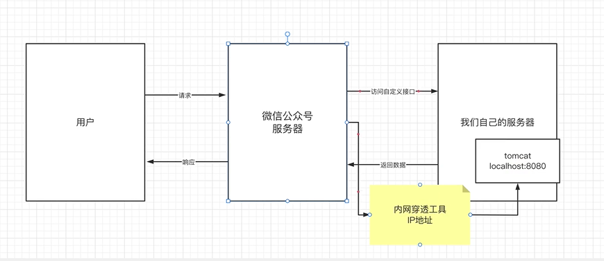
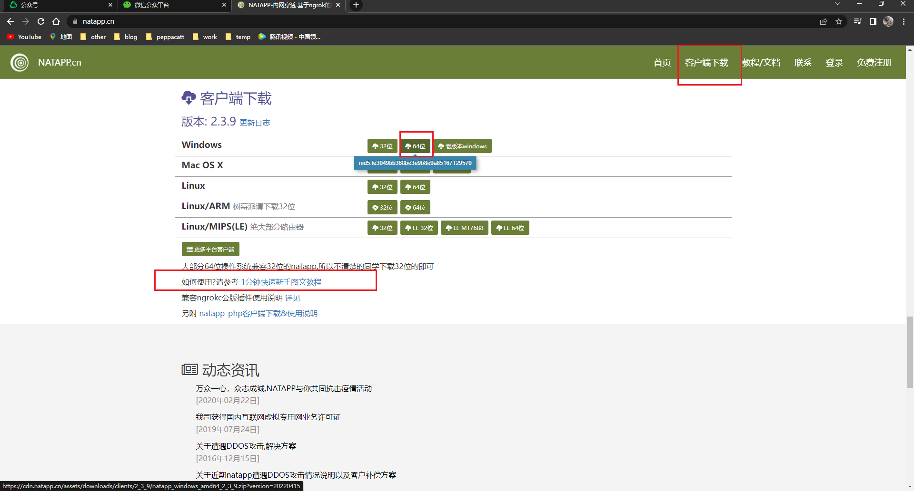
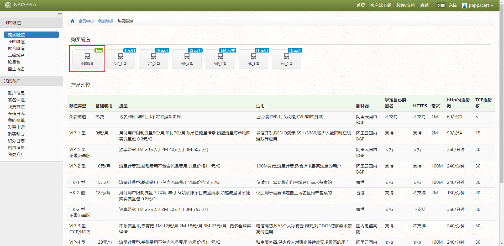
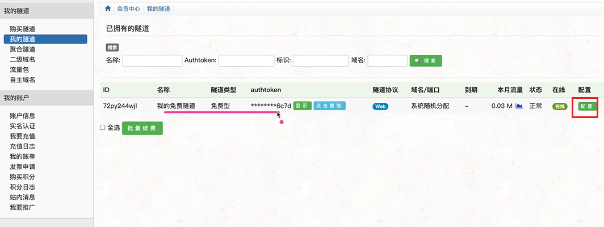
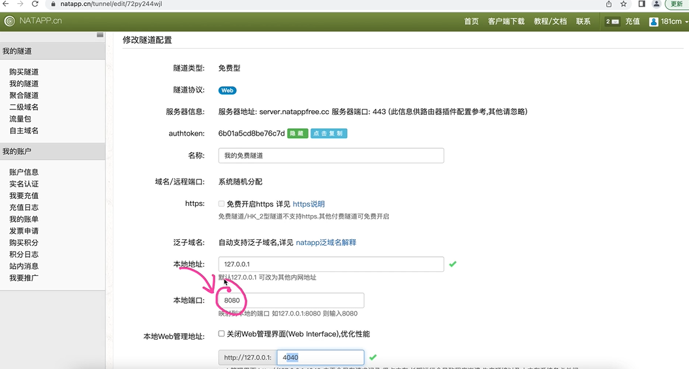
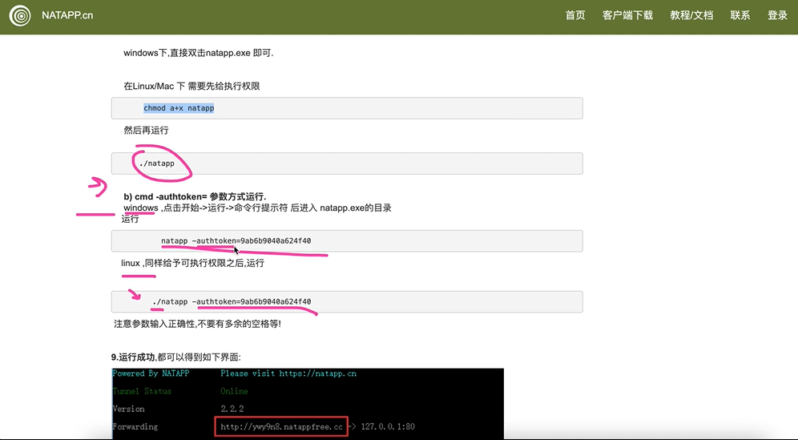
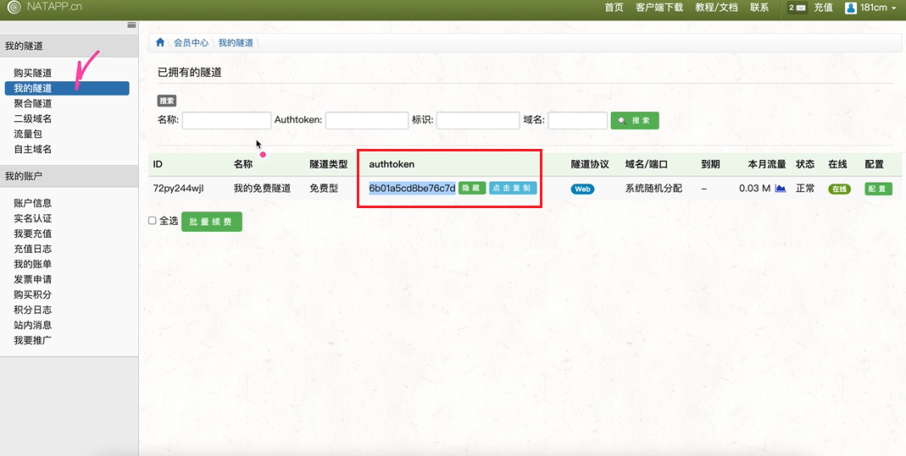
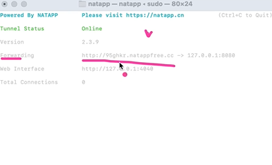
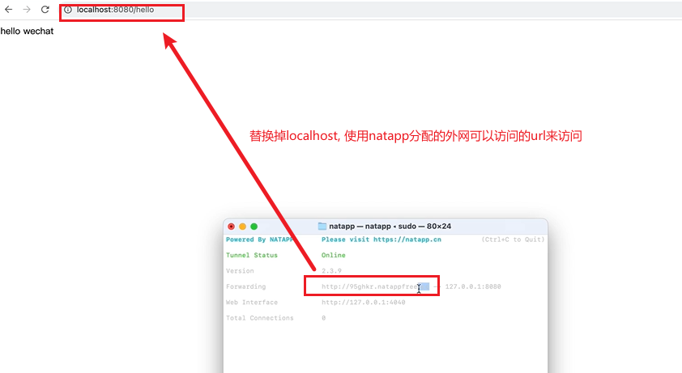

# 1 简介

## 1.1 什么是内网穿透

我们自己在本地启动了一个tomcat服务器, 因为是本地启动的, 没有独立的ip, 所以外网是无法访问的.
想要被外网访问, 可以借助内网穿透工具, 将内网穿透工具提供的ip和我们本地的tomcat做一个映射,
外网访问该ip时, 就会传递到我们自己本地的服务器

## 1.2 内网穿透工具

网址: natapp.cn

下载工具

## 1.2 如何使用

可以使用免费的隧道测试开发

### 1.2.1 网页端配置

只需要配置一下本地服务器的端口

### 1.2.2 程序配置

带authtoken执行cmd

成功

## 1.3 使用

1 启动本地服务器

2 使用natapp启动成功后分配的url来访问

