# 1 简介

## 1.1 公众号的分类

### (1) 订阅号

为媒体和个人提供一种新的信息传播方式, 主要功能是在微信侧给用户传达资讯(功能类似报纸,
提供新闻信息或娱乐的趣事)

适用主要人群: 个人, 媒体

群发次数: 订阅号(认证用户, 非认证用户) 1天可群发1条消息(群发给所有用户)

### (2) 服务号

为企业和组织提供更强大的业务服务与用户管理管理能力, 主要偏向服务类交互(类似银行, 12315, 114等)

适用主要人群: 企业, 政府或其他组织

群发次数: 服务号1个月(按自然月)内可发送4条群发消息

## 1.2 注册微信公众号

注册网址: mp.weixin.qq.com

注册
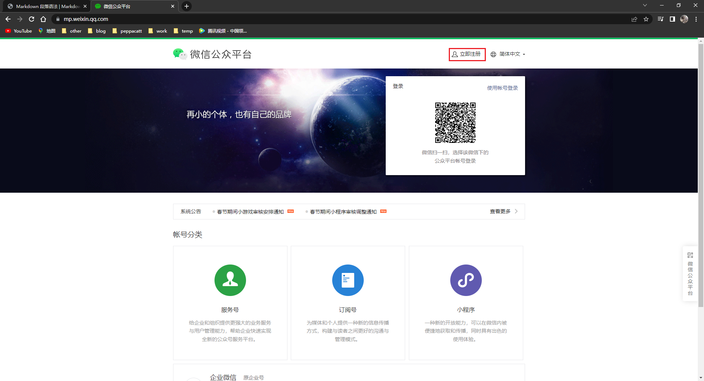

选择订阅号
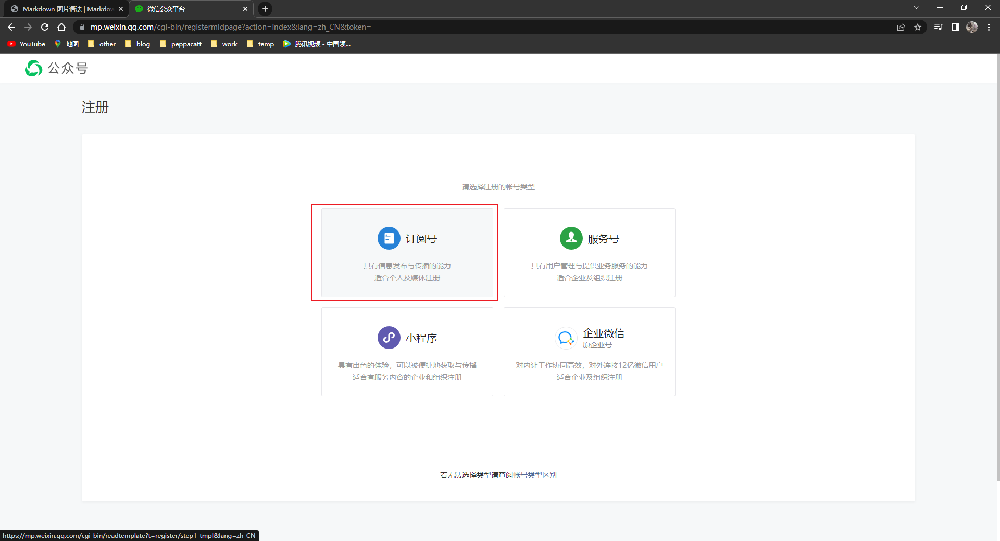

选择中国内地, 确定
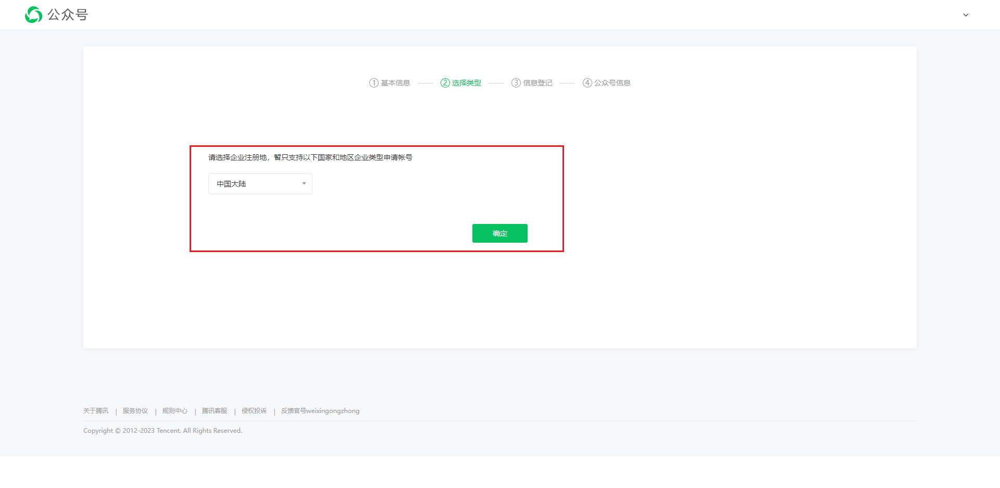

选订阅号
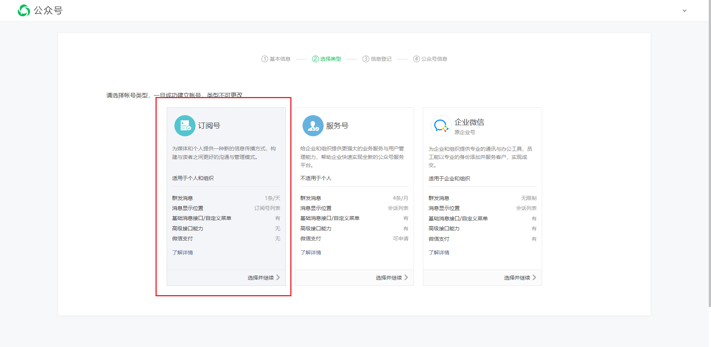

主体类型选个人
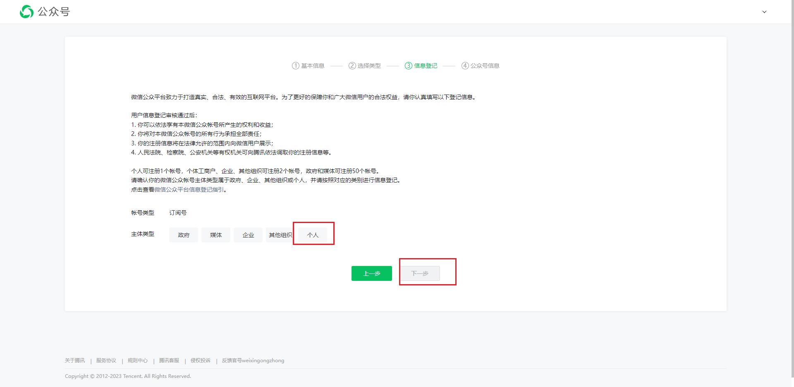

填写主要信息,需要一个微信扫码,作为该公众号的管理员,该微信必须绑定银行卡, 后点击继续
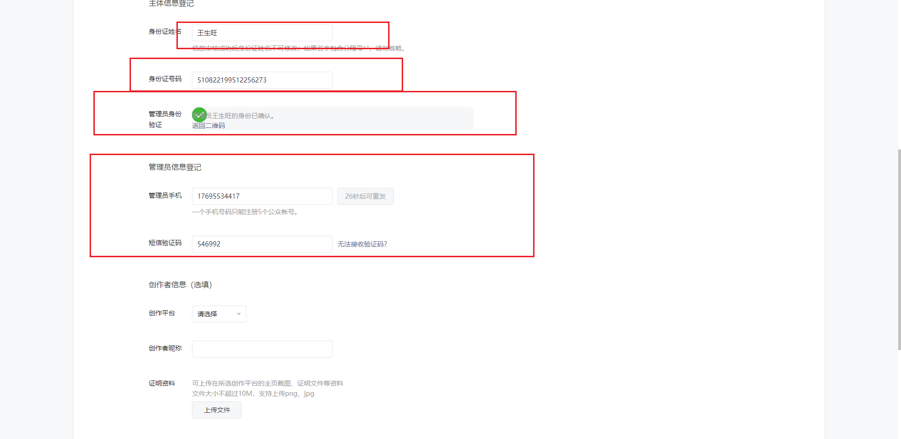

填写信息,完成
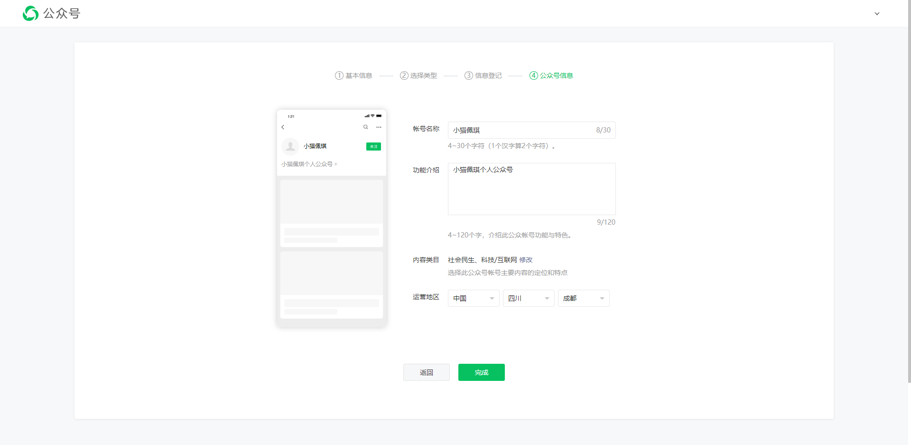

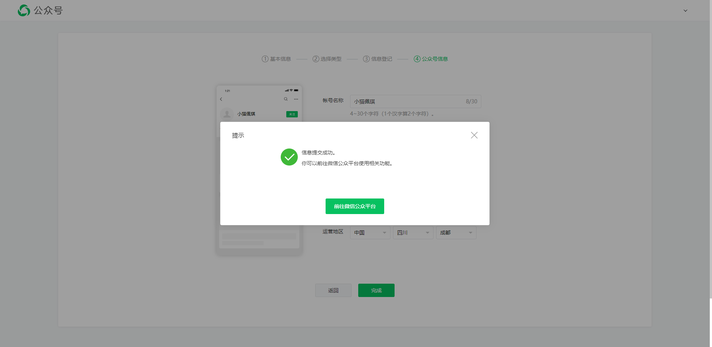

## 1.3 测试号申请

### 1.3.1 测试号入口

入口1

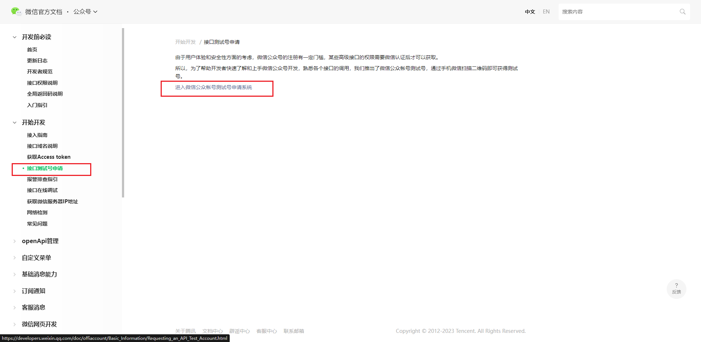

入口2
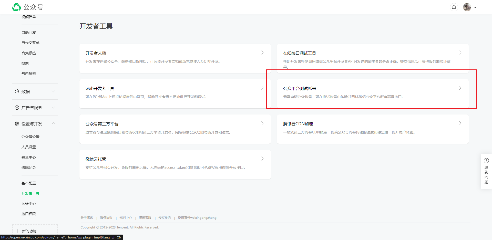

# 2 微信与自己服务器的验证

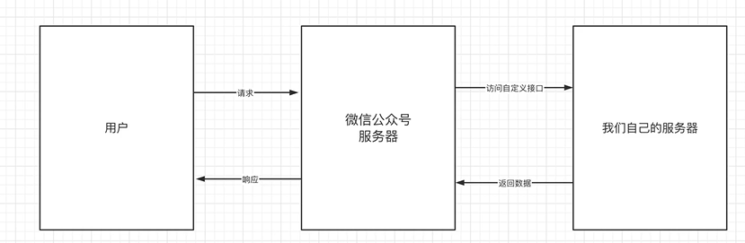

可参考微信官方文档

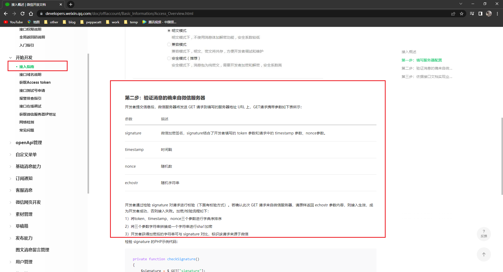

```java
    @GetMapping("/verify")
    public String verify(String signature, String timestamp, String nonce, String echostr) {
        String vxToken = "peppacatt";
        // 1 将token, timestamp, nonce三个参数按照字典序排序
        List<String> vxParamList = Arrays.asList(vxToken, timestamp, nonce);
        Collections.sort(vxParamList);
        // 2 将三个参数字符串拼接成一个一个字符串进行sha1加密
        StringBuilder vxParamSb = new StringBuilder();
        for (String item : vxParamList) {
            vxParamSb.append(item);
        }
        try {
            MessageDigest messageDigest = MessageDigest.getInstance("sha1");
            byte[] digest = messageDigest.digest(vxParamSb.toString().getBytes());
            // 转为与signature相同的16进制字符串
            StringBuilder hexSb = new StringBuilder();
            for (byte item : digest) {
                String highFourBit = Integer.toHexString((item >> 4) & 15);
                String lowFourBit = Integer.toHexString(item & 15);
                hexSb.append(highFourBit);
                hexSb.append(lowFourBit);
            }
            // 3 将加密的后字符串与signature对比, 如果相同则表示该请求来自微信
            LOGGER.info("signature: {}\n,hexSb: {}, bytes: {}\n, echostr: {}\n", signature, hexSb, digest, echostr);
            if (StrUtil.isNotEmpty(signature) && signature.equals(hexSb.toString())) {
                return echostr;
            }
        } catch (NoSuchAlgorithmException e) {
            LOGGER.error("MessageDigest error: {}", e.getMessage());
        }
        return null;
    }
```