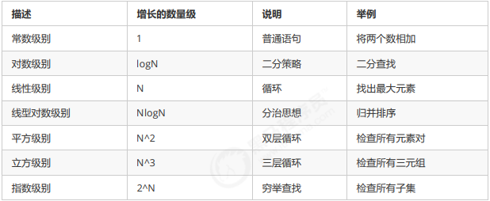

## 时间复杂度
**根据函数增长图得知**
- 随着输入规模的增大, 算法的常数操作可以忽略不计
- 随着输入规模的增大, 最高次项的系数可以忽略不计
- 随着输入规模的增大, 最高次项的指数大的,会增长的更快(算法中n的最高次幂越小, 算法效率越高)

**随着输入规模的增大时, 有以下规则**
- 算法函数中的常数可以忽略
- 算法函数中的最高次幂项的系数可以忽略
- 算法函数中最高次幂越小, 算法效率越高

**时间复杂度练习**  
算法一:
```java
public static void main(String[] args) {
    int sum = 0;//执行1次
    int n = 100;//执行1次
    sum = (n + 1) * n / 2;//执行1次
    System.out.println("sum=" + sum);
}
```
算法二:
```java
public static void main(String[] args) {
    int sum = 0;//执行1次
    int n = 100;//执行1次
    for (int i = 1; i <= n; i++) {
        sum += i;//执行了n次
    }
    System.out.println("sum=" + sum);
}
```
算法三:
```java
public static void main(String[] args) {
    int sum = 0;//执行1次
    int n = 100;//执行1次
    for (int i = 1; i <= n; i++) {
        for (int j = 1; j <= n; j++) {
            sum += i;//执行n^2次
        }
    }
    System.out.println("sum=" + sum);
}
```

时间复杂度依次是:O(1) O(n) O(n^2)

**常见的一些时间复杂度计算**  
常数阶  
一般不涉及循环操作的都是常数阶，因为它不会随着n的增长而增加操作次数  
不管输入规模n是多少，都执行2次，根据大O推导法则，常数用1来替换，所以上述代码的时间复杂度
为O(1)
```java
public class Main {
    public static void main(String[] args) {
        int n = 100;
        int i = n + 2;
        System.out.println(i);
    }
}
```
对数阶  
由于每次i*2之后，就距离n更近一步，假设有x个2相乘后大于n，则会退出循环。由于是2^x=n,得到x=log(2)n,所
以这个循环的时间复杂度为O(logn);  
对于对数阶，由于随着输入规模n的增大，不管底数为多少，他们的增长趋势是一样的，所以我们会忽略底数。
```java
public class Main {
    public static void main(String[] args) {
        int i = 1, n = 100;
        while (i < n) {
            i = i * 2;
        }
    }
}
```
线性阶  
一般含有非嵌套循环涉及线性阶，线性阶就是随着输入规模的扩大，对应计算次数呈直线增长  
它的循环的时间复杂度为O(n),因为循环体中的代码需要执行n次
```java
public static void main(String[] args) {
    int sum = 0;
    int n = 100;
    for (int i = 1; i <= n; i++) {
        sum += i;
    }
    System.out.println("sum=" + sum);

}
```
平方阶  
一般嵌套循环属于这种时间复杂度  
这段代码，n=100，也就是说，外层循环每执行一次，内层循环就执行100次，那总共程序想要从这两个循环
中出来，就需要执行100*100次，也就是n的平方次，所以这段代码的时间复杂度是O(n^2).

```java
public static void main(String[] args) {
    int sum = 0, n = 100;
    for (int i = 1; i <= n; i++) {
        for (int j = 1; j <= n; j++) {
            sum += i;
        }
    }
    System.out.println(sum);
}
```
立方阶  
一般三层嵌套循环属于这种时间复杂度  
这段代码，n=100，也就是说，外层循环每执行一次，中间循环循环就执行100次，中间循环每执行一次，最
内层循环需要执行100次，那总共程序想要从这三个循环中出来，就需要执行100100100次，也就是n的立方，所
以这段代码的时间复杂度是O(n^3).
````java
public class Main {
    public static void main(String[] args) {
        int x = 0, n = 100;
        for (int i = 1; i <= n; i++) {
            for (int j = i; j <= n; j++) {
                for (int j = i; j <= n; j++) {
                    x++;
                }
            }
        }
        System.out.println(x);
    }
}
````
**常见的时间复杂度例子**
