# 1 英语语法体系

## 1.1 简单句

把拆到不能再拆的句子,否则会导致语义不完整的句子称为简单句

所有的简单句都可以分为: 

什么 + 怎么样  (主语subject + 谓语predicate)

换句话说, 几乎所有的英语句子结构都是: 主语 + 谓语

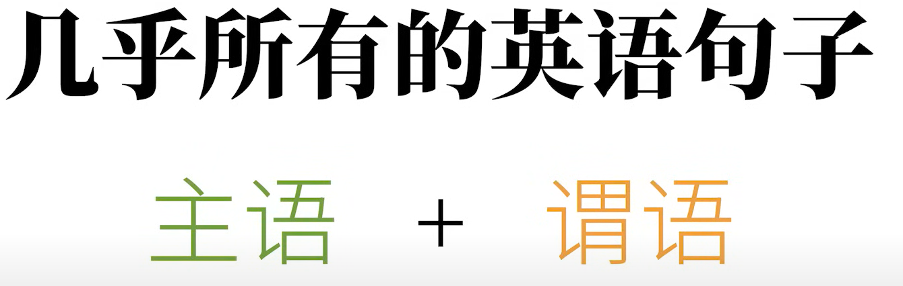

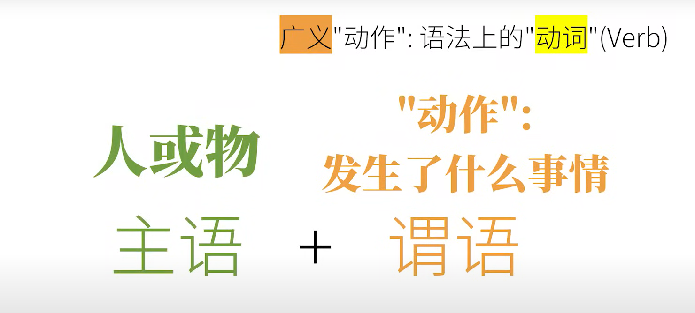

### 1.1.1 有哪些"动作"(动词)?

以下这几种基本的动词对应的简单句的类型, 可以说是涵盖了英语所有的句子

其实所说的"主谓宾结构"就是对应下面的第(2)种动词对应的简单句类型

谓语动词只是谓语的一部分, 但是在平时, 为了方便, 很多人会直接称呼谓语动词为谓语

而把"主语 + 谓语动词 + 宾语"这种结构直接称之为"主语谓语宾语"

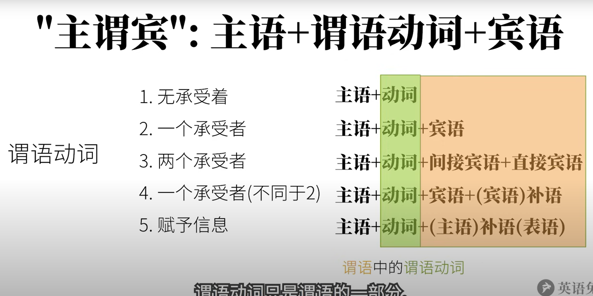

####  (1 ) 不及物动词(Intransitive Verbs)

可以独立完成的动作

 这样没有承受者的动词叫做不及物动词

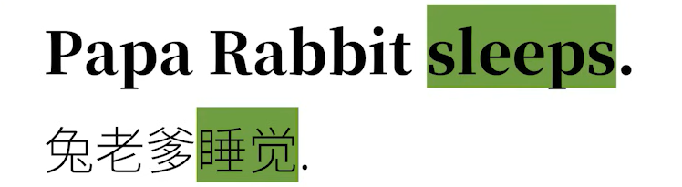

对应的句子结构: 主语 + (不及物)动词

#### (2) 单及物动词(Monotransitive Verbs)

有一个动作的承受者

如果光说"兔老爹喜欢", 就会觉得语义不完整, 像"喜欢"这样的动词没有承受者就么有什么实际意义

这个动作的承受者就是: 宾语(object)

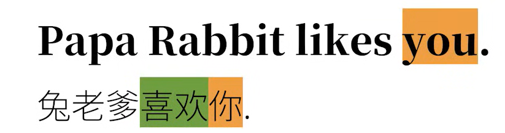

对应的句子成分结构: 主语 + (单及物)动词 + 宾语

#### (3) 双及物动词(Ditransitive Verbs)

有两个动作的承受者

这里的核心动词是"teach"(教), 教授的知识是英语, 而知识的接受对象是你, 把这样的动词的两个承受者称为: 直接宾语(direct object) 和 间接宾语(indirect object)

其实光说"Papa Rabbit teaches English"就已经语义很完整了, 所以"English"在这里就是直接宾语, 而如果光说"Papa Rabbit teaches you", 而没有上下文的话, 肯定会觉得缺了什么, 所以"you"在这里是间接宾语

这样既有直接宾语的动词, 也有简介宾语的动词, 也是及物动词的一种, 更准确的说, 它属于双及物动词(ditransitive verbs)

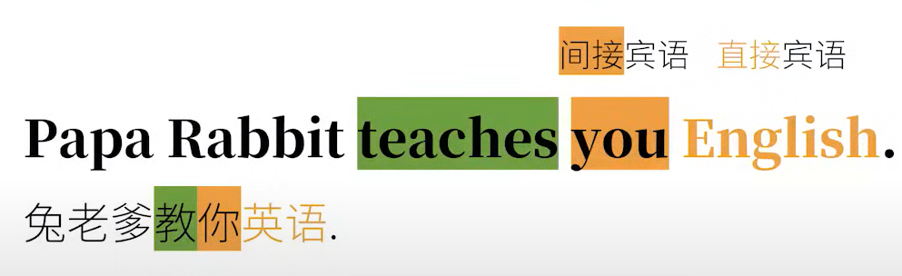

对应的句子成分结构: 主语 + (双及物)动词 + 间接宾语 + 直接宾语

#### (4) 复杂及物动词(Complex-transitive Verbs)

只有一个动作承受者, 不同于(2)

这里虽然只有一个动作的承受者, 也就是宾语"you", 但是光说"Papa Rabbit considers you", 肯定会觉得话没有说完, 可是宾语后面的"smart" 也不像第(3)种情况那样是另一个动作的承受者

这样的动词, 必须要有个补充承受者的信息才意义完整, 这个补充的信息在语法上称为补足语, 或补语(complement), 更明确也可以说是宾语补语(object complement)

这样需要有补语的动词, 称之为复杂及物动词(complex-transitive verbs)

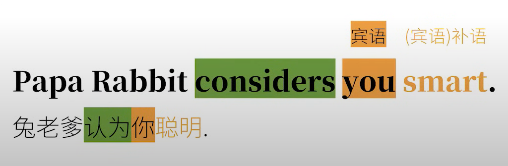

对应的句子成分结构: 主语 + (复杂及物)动词 + 宾语 + (宾语)补语

#### (5) (连)系动词(Linking Verbs)

不是个"动作", 把这个词后面的信息赋予给前者

该种情况里的动词所表达的"动作", 和狭义上说的"动作"不太一样,如: 

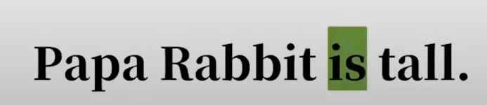

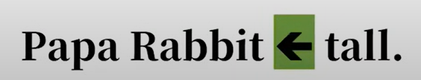

这里的"is"在中文里经常翻译成"是", 但它实际上的作用其实很简单, 就是把这个动词之后的信息赋予给前面的主语

以"is"这样的词为代表的一类词, 作用就是把后面的信息赋予给前面的词, 再例如:

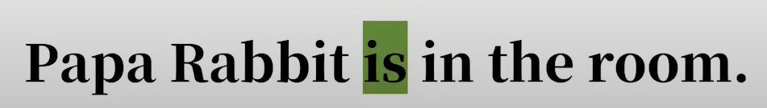

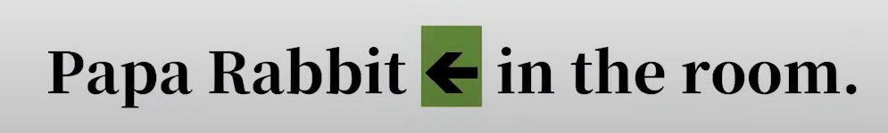

其实就是把in the room这个状态性质, 赋予给"Papa Rabbit"而已

再例如:

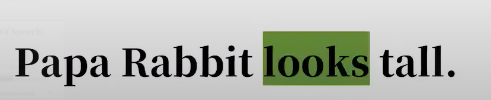

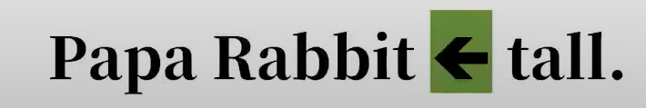

这里并不是"兔老爹看某某东西", 而意思是"兔老爹看上去高", 其实也是动词后面的"tall"赋予给前面的主语"Papa Rabbit"而已, 只不过这里比前面的"is"多了个"看上去"的意义

再例如"Papa Rabbit smells nice", "兔老爹闻起来香", 就是把"nice"赋予给"Papa Rabbit", 只不过还有"闻起来"这层意思

像这样的赋予主语某种性质状态的"划等号"的动词, 称之为连系动词,(linking verbs), 连系动词也被称之为系动词, 而系动词后面的补充信息也自然就是补足语, 更精确点可以说是主语补语, 而主语补语还有另一个名字叫做表语(predicative)

对应的句子成分的结构: 主语 + 系动词 + (主语)补语(表语)

### 1.1.1  句子成分

#### (1) 主语Subject

#### (2) 谓语动词(谓语)Predicate

#### (3) 宾语Object

#### (4) 宾语补语Object Complement

#### (5) 主语补语Subject Complement (又称表语Predicative)

#### (6) 定语Attribute

主要用来修饰主语胡或宾语,如:

"The little white"就是主语"rabbit"的定语

"a large"就是宾语"carrot"的定语

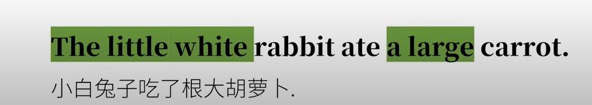

#### (7) 状语Adverbial

主要用来修饰谓语动词

"quickly"就是"ate"的状语

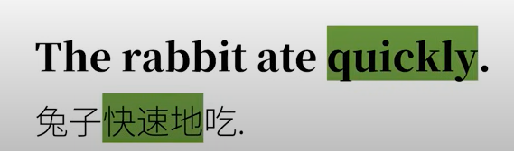

#### (8) 同位语Appositive

主要用来再把主语或宾语说一遍

这里的"an English teacher"就是把"Papa Rabbit"用不同的方式再说一遍, 在这里算是和主语同等地位

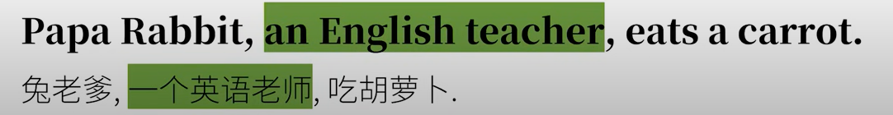