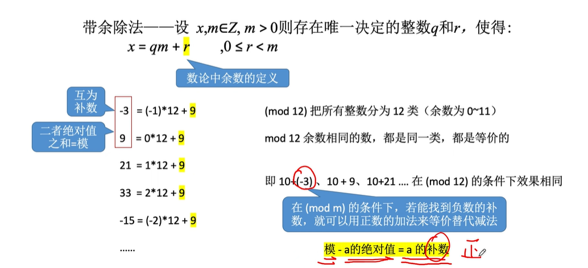

## 原码反码补码
计算机的二进制表示正负: 0表示正, 1表示负  
n位的无符号数表示范围: 0 ~ 2^n - 1  

**原码**  
一个数转换为2进制之后的值就是原码  
正数的原反补相同, 只有负数才去计算它的补码  
**反码**  
符号位不变,其余位按位取反(1变成0, 0变成1)  
反码只是原码转换为补码的一个中间状态, 没有其他任何作用  
**补码**  
反码末位+1  
将负数的补码转换为原码的方法相同: 先符号位不变其余位按位取反,再末位+1  

## 为什么会有原码反码补码
原码表示的无符号数运算后的结果没问题  
但是如果用原码表示的有符号数来进行运算是就会出现问题
  
所以要把 正数 + 负数 的情况转化为 正数 - 正数  
  

所以可以用加法代替减法,就像时钟一样,一圈是12个单位,6 - 1 等于3可以用6 + 11来表示  
(mod 12)把所有整数分为12类,余数为0~11  
(mod 12)余数相同的数,都是同一类,都是等价的  

如果a是负数,那么就可以用模减去a的绝对值,得到的数就是负数a的补数
