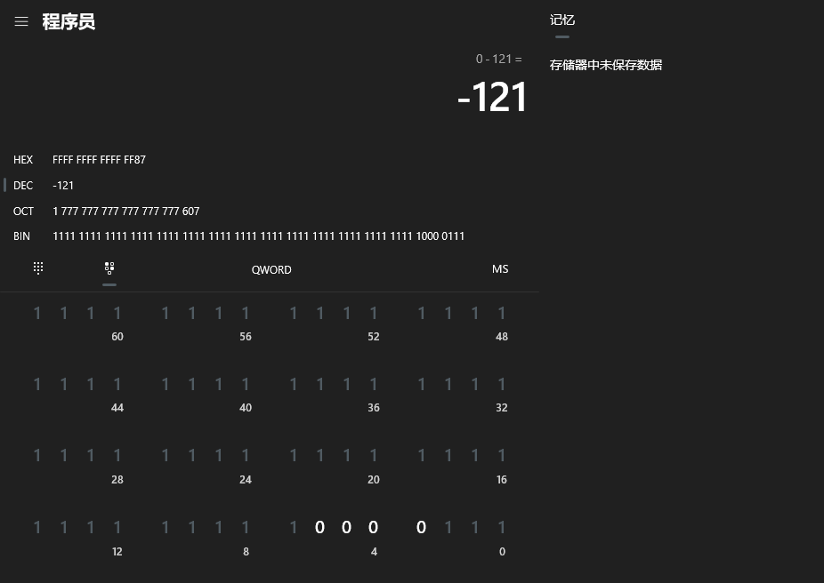
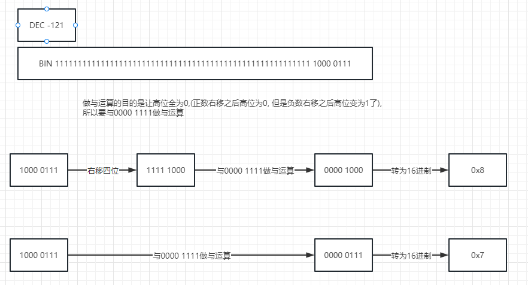

# 1 byte数组转为16进制

hexSb: 8740e53a0a13450ebce1ad71775f4b5927f1c4e1

bytes: [-121, 64, -27, 58, 10, 19, 69, 14, -68, -31, -83, 113, 119, 95, 75, 89, 39, -15, -60, -31]

在java中1个byte表示一个字节

一个字节是8位, 1111 1111, 可以看出一个字节可以分为高八位和低八位, 二进制的1111表示十进制的15,
所以一个字节可以表示两个16进制

所以一个byte可以表示两个16进制, bytes中一共有20个元素, 可以表示为40个16进制

## 1.1 正数的转换

以第一个元素-121来举例

1000 0111

1 高四位的转换  
先右移四位, 再与0000 1111做与运算(&运算两个都为1才为1,否则为0),
做与运算的目的是让高四位为0, 低四位不变

2 低四位的转换
因为就在低位所以不用右移, 只需要与0000 1111做与运算

