# 1 英语语法体系

## 1.1 简单句(Simple Sentense)

把拆到不能再拆的句子,否则会导致语义不完整的句子称为简单句

所有的简单句都可以分为: 

什么 + 怎么样  (主语subject + 谓语predicate)

换句话说, 几乎所有的英语句子结构都是: 主语 + 谓语

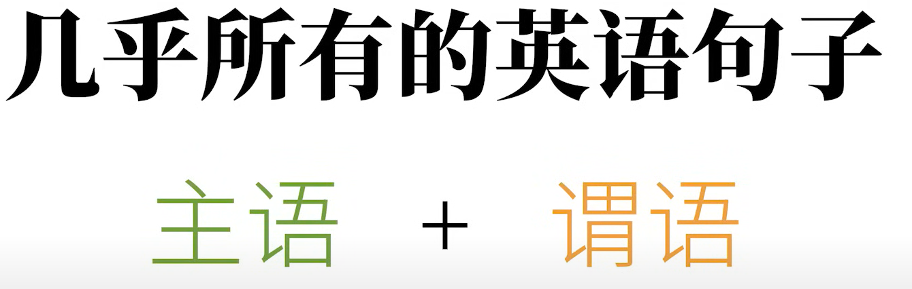

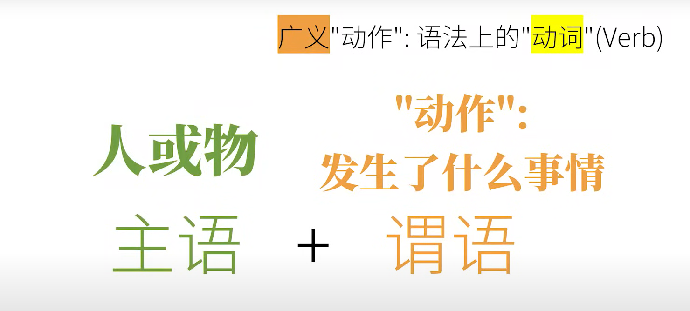

### 1.1.1 有哪些"动作"(动词)?

以下这几种基本的动词对应的简单句的类型, 可以说是涵盖了英语所有的句子

其实所说的"主谓宾结构"就是对应下面的第(2)种动词对应的简单句类型

谓语动词只是谓语的一部分, 但是在平时, 为了方便, 很多人会直接称呼谓语动词为谓语

而把"主语 + 谓语动词 + 宾语"这种结构直接称之为"主语谓语宾语"

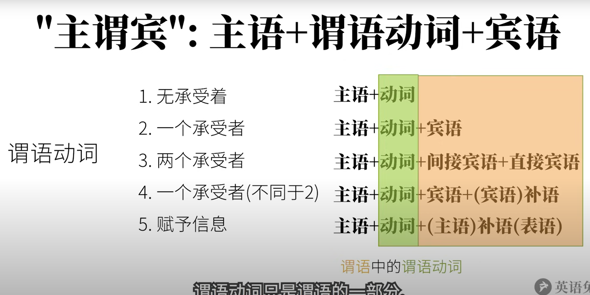

####  (1 ) 不及物动词(Intransitive Verbs)

可以独立完成的动作

 这样没有承受者的动词叫做不及物动词

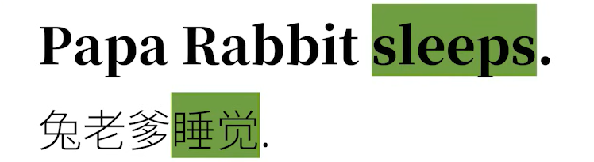

对应的句子结构: 主语 + (不及物)动词

#### (2) 单及物动词(Monotransitive Verbs)

有一个动作的承受者

如果光说"兔老爹喜欢", 就会觉得语义不完整, 像"喜欢"这样的动词没有承受者就么有什么实际意义

这个动作的承受者就是: 宾语(object)

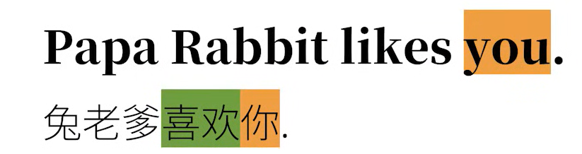

对应的句子成分结构: 主语 + (单及物)动词 + 宾语

#### (3) 双及物动词(Ditransitive Verbs)

有两个动作的承受者

这里的核心动词是"teach"(教), 教授的知识是英语, 而知识的接受对象是你, 把这样的动词的两个承受者称为: 直接宾语(direct object) 和 间接宾语(indirect object)

其实光说"Papa Rabbit teaches English"就已经语义很完整了, 所以"English"在这里就是直接宾语, 而如果光说"Papa Rabbit teaches you", 而没有上下文的话, 肯定会觉得缺了什么, 所以"you"在这里是间接宾语

这样既有直接宾语的动词, 也有简介宾语的动词, 也是及物动词的一种, 更准确的说, 它属于双及物动词(ditransitive verbs)

对应的句子成分结构: 主语 + (双及物)动词 + 间接宾语 + 直接宾语

#### (4) 复杂及物动词(Complex-transitive Verbs)

只有一个动作承受者, 不同于(2)

这里虽然只有一个动作的承受者, 也就是宾语"you", 但是光说"Papa Rabbit considers you", 肯定会觉得话没有说完, 可是宾语后面的"smart" 也不像第(3)种情况那样是另一个动作的承受者

这样的动词, 必须要有个补充承受者的信息才意义完整, 这个补充的信息在语法上称为补足语, 或补语(complement), 更明确也可以说是宾语补语(object complement)

这样需要有补语的动词, 称之为复杂及物动词(complex-transitive verbs)

对应的句子成分结构: 主语 + (复杂及物)动词 + 宾语 + (宾语)补语

#### (5) (连)系动词(Linking Verbs)

不是个"动作", 把这个词后面的信息赋予给前者

该种情况里的动词所表达的"动作", 和狭义上说的"动作"不太一样,如: 

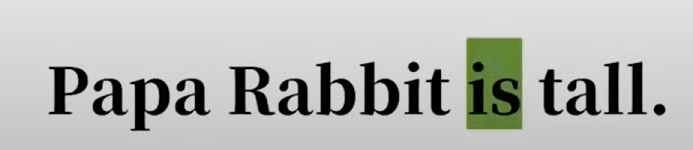

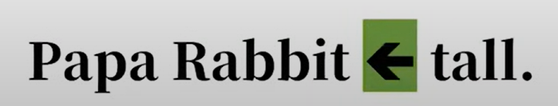

这里的"is"在中文里经常翻译成"是", 但它实际上的作用其实很简单, 就是把这个动词之后的信息赋予给前面的主语

以"is"这样的词为代表的一类词, 作用就是把后面的信息赋予给前面的词, 再例如:

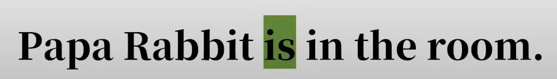

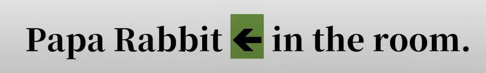

其实就是把in the room这个状态性质, 赋予给"Papa Rabbit"而已

再例如:

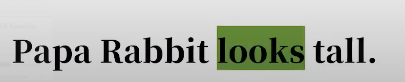

这里并不是"兔老爹看某某东西", 而意思是"兔老爹看上去高", 其实也是动词后面的"tall"赋予给前面的主语"Papa Rabbit"而已, 只不过这里比前面的"is"多了个"看上去"的意义

再例如"Papa Rabbit smells nice", "兔老爹闻起来香", 就是把"nice"赋予给"Papa Rabbit", 只不过还有"闻起来"这层意思

像这样的赋予主语某种性质状态的"划等号"的动词, 称之为连系动词,(linking verbs), 连系动词也被称之为系动词, 而系动词后面的补充信息也自然就是补足语, 更精确点可以说是主语补语, 而主语补语还有另一个名字叫做表语(predicative)

对应的句子成分的结构: 主语 + 系动词 + (主语)补语(表语)

### 1.1.1  句子成分

#### (1) 主语Subject

#### (2) 谓语动词(谓语)Predicate

#### (3) 宾语Object

#### (4) 宾语补语Object Complement

#### (5) 主语补语Subject Complement (又称表语Predicative)

#### (6) 定语Attribute

主要用来修饰主语胡或宾语,如:

"The little white"就是主语"rabbit"的定语

"a large"就是宾语"carrot"的定语

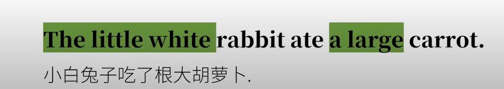

#### (7) 状语Adverbial

主要用来修饰谓语动词

"quickly"就是"ate"的状语

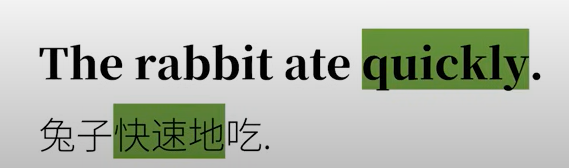

#### (8) 同位语Appositive

主要用来再把主语或宾语说一遍

这里的"an English teacher"就是把"Papa Rabbit"用不同的方式再说一遍, 在这里算是和主语同等地位

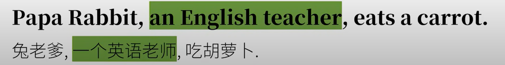

## 1.2 复合句(Compound Sentence)

复合句(compound sentence)就是句子简单的叠加, 是并列关系, 又叫做并列句

## 1.3 复杂句(Complex Sentence)

复杂句就是把一个句子套在另外一个句子里, 甚至一个句子套的一个句子还能再套一个句子...一直套下去, 这是一种从属关系

在这里一个句子套另一个句子, 再英语语法分别叫做主句(main clause)和从句(subordinate clause)

从句说白了就是把简单句修改一下来充当另外一个句子的句子成分

比如我们修改一个简单句, 它就可以充当另外一个句子的主语, 这就是主语从句

比如我们修改一个简单句,他就可以充当另一个句子的宾语, 这就是宾语从句

### 1.3.1 名词性从句

以下几种从句都具有名词的性质, 所以又合称为名词性从句

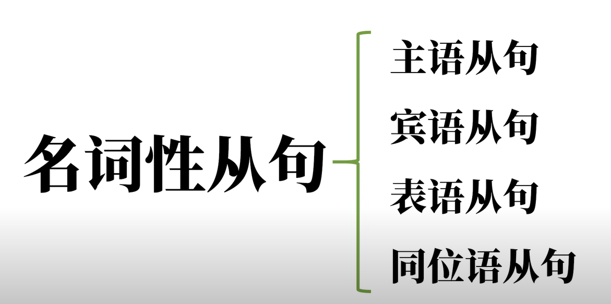

### 1.3.2 词类

英语的十大词类

句子成分和句子中的词类是完全不同的概念

句子成分中最特殊的就是谓语动词这一类, 其他句子成分可能是不同词类, 但是谓语动词只可能是动词

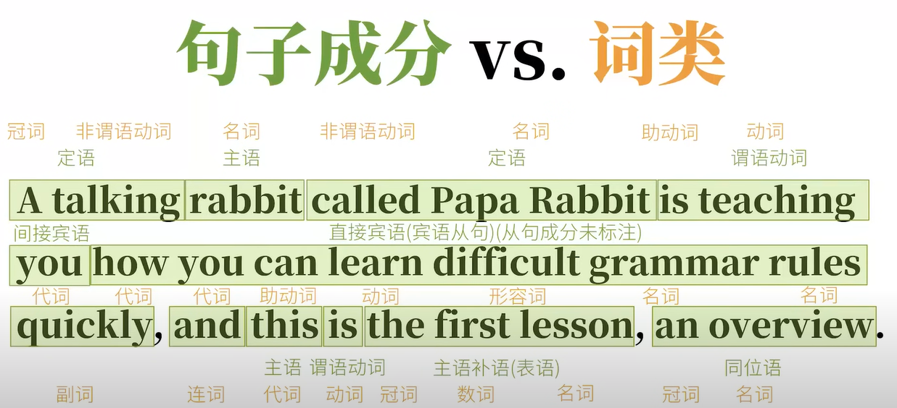

#### (1) 名词(Nouns)

表人和物

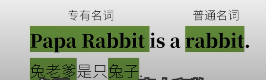

#### (2) 冠词(Articles)

英语中说明人和事物

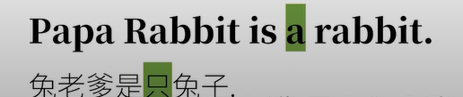

#### (3) 代词(Pronouns)

代替人和物

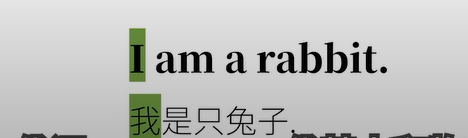

#### (4) 形容词(Adjectives)

形容人和物

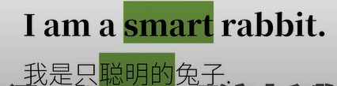

#### (5) 数词(Numerals)

表数量

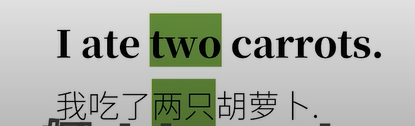

#### (6) 副词(Adverbs)

修饰动作或形容词

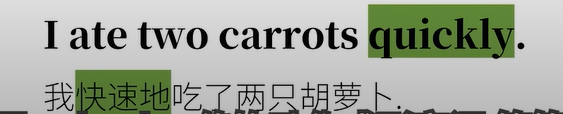

#### (7) 介词(Prepositions)

表示和其他词关系的词

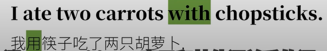

#### (8) 叹词(Interjections)

表感叹

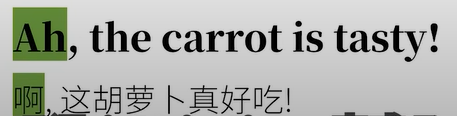

#### (9) 连词(Conjunctions)

连接词和句

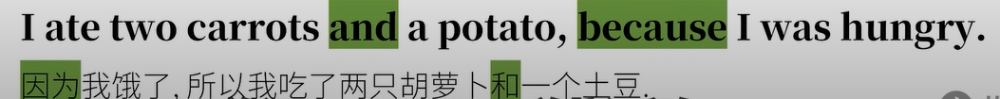

#### (10) 动词(Verbs)

### 1.3.3 谓语动词三大本领

#### (1) 表示动作的时间

比如动作可能在过去或将来

英语动词描述时间可能有四种: 过去, 现在, 将来, 过去将来(从过去某个时间点"算将来")

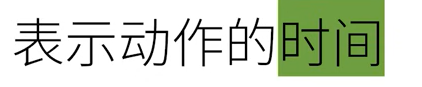

#### (2)表示动作的状态

比如动作可能是已经完成的状态或者正在进行的状态

英语动词描述状态也可能是四种: 完成, 一般(未说明), 进行, 完成进行(不但完成而且继续)

#### (-) 时态

以上两者合在一起称为时态, tense

英语的时态是""时间""+"状态"合在一起, 而并非只是时间

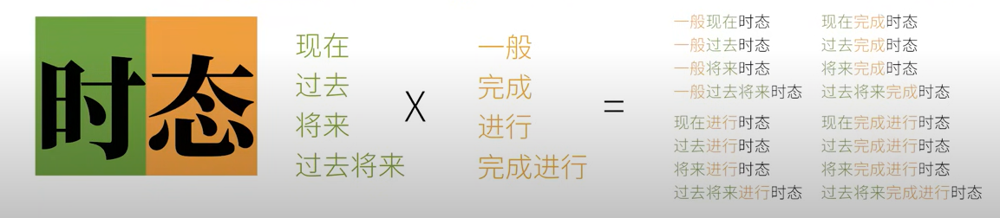

#### (3) 表示动作的假设, 情感等

这个叫做动词的语气, 和咱们平时说话的那个"语气"不是一个"语气", 这里指语法的"语气", 比如虚拟语气, 用来表示意愿, 和事实相反的假设等

在"If I were a rabbit..."中, "I"后的were(而不是was)就暗示了, 我其实并不是只兔子, 中文动词也没有这样的特性

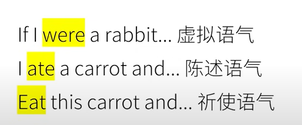

#### (-) 助动词

英语的谓语动词本身往往是不能够独立完成刚才说的那些本领, 以及另外一些其它的本领, 而且谓语动词独自也无法完成比如表示否定, 可能性, 必须性等意思,想让谓语动词充分发挥, 我们必须用到另一类经常和动词一起用的词, 帮助"完成任务", 他们就是"助动词(Auxiliary Verbs)"

很多助动词喜欢伪装, 他们除了作助动词(没有实义, 只是帮助谓语动词而已), 还可以作实义动词, 甚至其他词性, 比如"can"还可以是"易拉罐", "might"可以是"力量", "must"可以是"发霉", "do"可以是"做某事", "have"可以是"拥有", "be"可以是"存在", 这些也恰恰是容易让人混乱的地方, 所以千万不要把助动词和它其他的身份(作实义动词)弄混淆

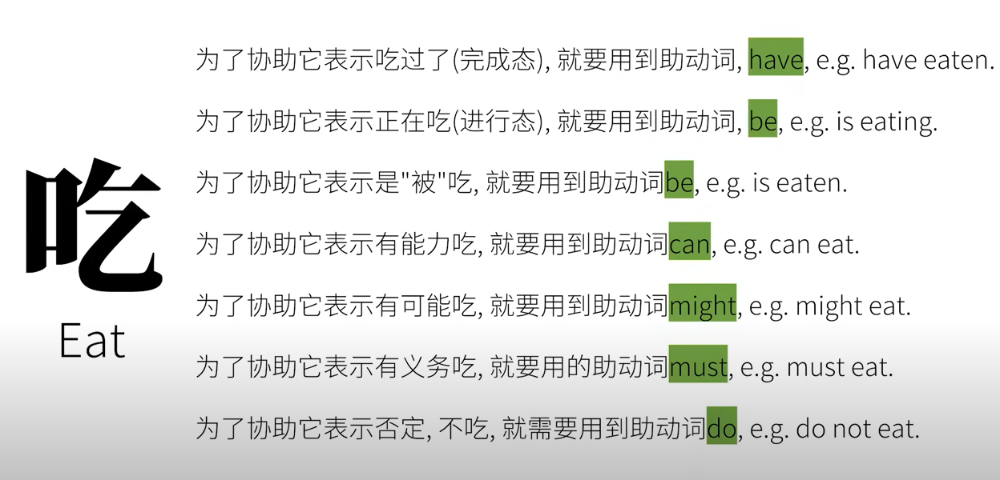

### 1.3.4 非谓语动词

非谓语动词没有"时态", "语气", "语态"这些本领

非谓语动词也是英语的一大难点

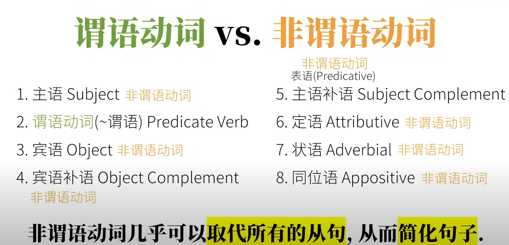

它们是以不同形式出现在句中, 包括:

#### (1) 动词不定式

不定式长的和谓语动词原型一样, 比如句中出现了"eat", 你并不能确定(如果无上下文)它是谓语动词, 还是不定式, 除非告诉你其它还有什么词

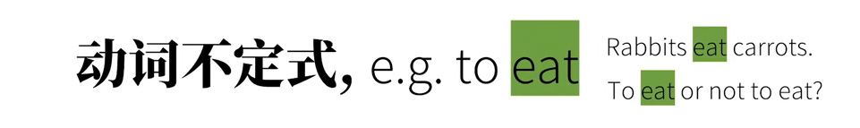

#### (2) 现在分词

现在分词和动名词长得和谓语动词的进行状态一样, 比如句中出现了"eating", 你并不能确定(如果无上下文)它是谓语动词进行中, 还是现在分词, 或者是动名词

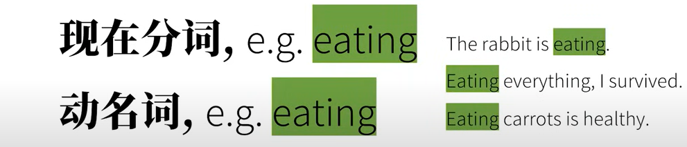

#### (3) 动名词

#### (4) 过去分词

过去分词长得和谓语动词的完成状态一样, 比如句中出现了"eaten", 你并不能确定它是谓语动词完成了, 还是过去分词

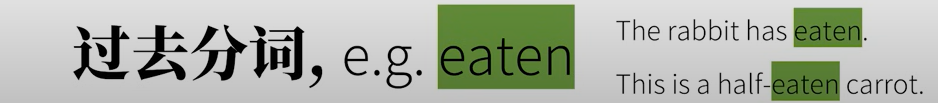

#### (-)

怎么全在说动词?

动词能够串起几乎所有的语法概念

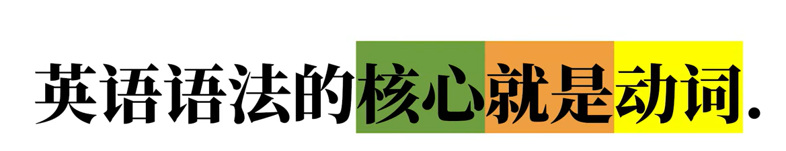

英语语法高度/粗略概括:

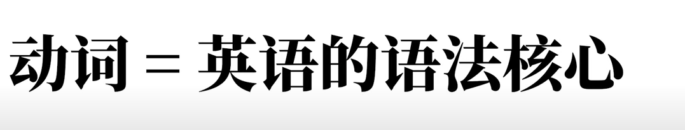

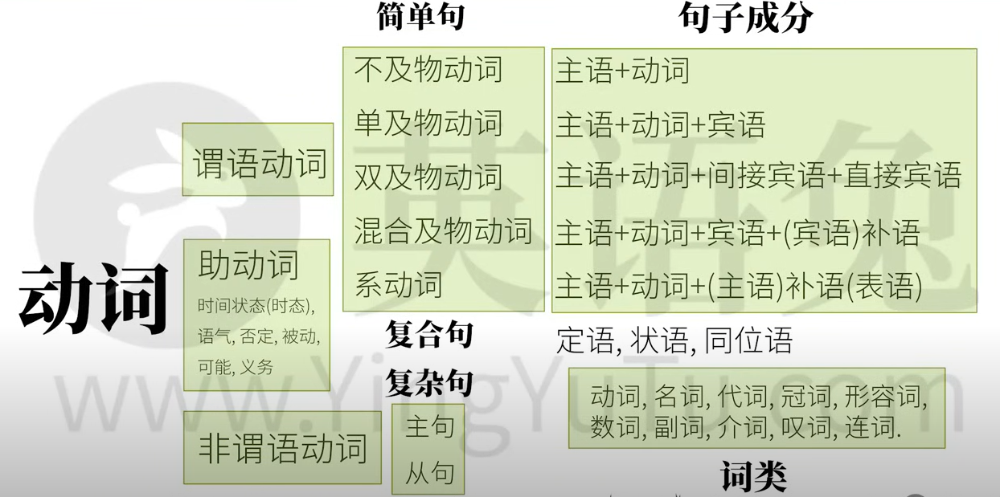